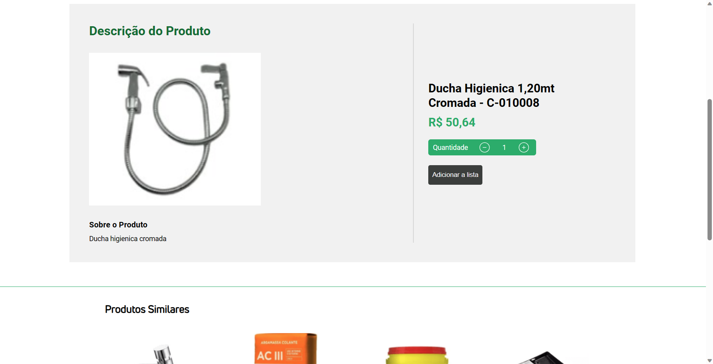
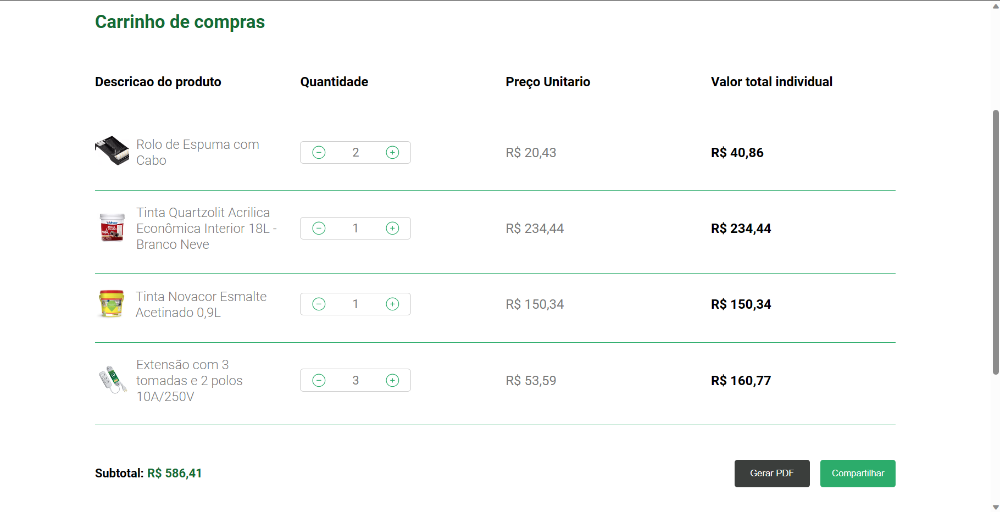

## Descriçao do Projeto

<!-- <h1>ColorMix</h1>

<h2>É uma plataforma online para explorar os produtos da loja ColorMix. Aqui estão algumas informações úteis para começar:</h2> 

<h3>Navegação de Produtos</h3>

- Explore categorias específicas para encontrar o que precisa.

- Ou navegue pelos produtos individualmente

<h3>Carrinho de compras</h3>

- Acesse o carrinho de compras para revisar todos os produtos selecionados.
- Você pode ajustar as quantidades, remover itens ou continuar comprando.

<h3>Gerando a Lista de Compras</h3>

- Ao finalizar suas escolhas, clique em "Gerar PDF" para gerar a lista de compras.
- Uma lista detalhada será exibida, mostrando o valor total de todos os produtos, bem como o valor individual de cada item.

<h3>Pesquisando Produtos</h3>

- Você pode pesquisar os produtos que você procura pelo nome deles

<h3>Como Contribuir</h3>

- Sinta-se à vontade para contribuir para a melhoria do Santa Rita Home Center. Se encontrar bugs ou tiver sugestões, por favor, abra uma issue no GitHub.
- Clone o repositório, faça as alterações necessárias e envie um pull request.
- Abaixo você tem mais informações sobre como contribuir com o projeto -->

## Instruções para utilizar o projeto via docker

Para utilizar esse projeto via docker você precisa ter o docker instalado e também o git.

-  Este projeto utiliza docker na versão 24.0.7
-  Você pode clonar o repositorio com: 'git clone "url do repositorio"'
-  Após clonar o repositorio, utilize o comando "cd ./ColorMixFront no terminal" para mudar o diretorio para o do projeto,
-  Depois inicie o docker em sua maquina
-  Após iniciar o docker, digite no terminal(pode ser do vscode ou terminal do sistema) o comando: "docker build -t color-mix ." esse comando faz a construção do container do projeto na sua maquina,
-  E inicie o projeto com o comando: "docker run --name color-mix -it --rm -p 3000:3000 color-mix",
-  Após isso acesse o projeto na url do seu navegador digitando na barra superior: localhost:3000, após seguir esses passos o projeto vai iniciar no seu navegador
- Para parar a execução digite o comando: 'docker stop color-mix'
- Para reiniciar a execução do container digite: 'docker start color-mix'

## Dependencies

- Node: v21.4.0
- React: 18.2.0
- NPM: 10.2.4
- Styled-Components: 6.1.1
- React-Router-DOM: 6.18.0
- React-PDF/renderer: 3.1.14
- React-Paginate: 8.2.0
- Swiper: 11.0.4

## Dev Dependencies

- Eslint: 8.45.0
- Vite: 4.4.5

## Acesso do projeto no modo de desenvolvimento

 Se você for utilizar esse projeto no modo de desenvolvimento, você vai precisar ter o node e o git instalado na sua maquina
 
- Clone o projeto com "git clone 'url do projeto'" no terminal(vscode ou terminal do seu sistema)
- Troque o atual para o do projeto com cd ./ColorMixFront
- Instale as dependências com "npm install"
- Rode o projeto com "npm run dev"
- Abra o projeto no seu navegador digitando na barra superior a url: localhost:5173
- Após isso o projeto estará rodando na sua maquina
